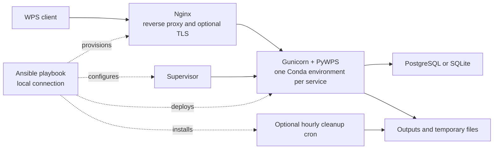

# PyWPS / ROOK Ansible Playbook

An Ansible playbook for deploying and maintaining a production [PyWPS](https://github.com/geopython/pywps) service, in particular [ROOK](https://github.com/roocs/rook).

The playbook installs and configures the complete service stack on a single host.



## What gets installed?

A typical ROOK deployment includes:

* **Nginx** as the public web server
* **PyWPS / ROOK** in a dedicated Conda environment
* **Supervisor** for the PyWPS service
* **PostgreSQL** for the PyWPS database
* **Slurm** for asynchronous WPS jobs
* monitoring, statistics and maintenance tools
* automatic cleanup of temporary files and WPS outputs

The playbook also manages the service account, directories, configuration files and permissions required by the installation.

## Quick start

Clone the repository:

```bash
git clone https://github.com/bird-house/ansible-wps-playbook.git
cd ansible-wps-playbook
```

Have a look at the example configurations in [`etc/`](https://github.com/bird-house/ansible-wps-playbook/tree/master/etc). They provide ready-to-use starting points for different PyWPS deployments.

For a minimal PyWPS installation, start with the Emu example:

```bash
cp etc/sample-emu.yml custom.yml
```

For a ROOK installation with Slurm, use the ROOK example instead:

```bash
cp etc/sample-rook.yml custom.yml
```

Edit `custom.yml` and replace the site-specific values shown in the sample.

Then deploy:

```bash
make play
```

That's it.

`make play` installs the required Ansible dependencies and runs the complete installation. The playbook is idempotent, so the same command can be used later to apply configuration changes or update an existing installation.

## Updating an installation

For normal maintenance, the Makefile provides two faster update paths.

Update PyWPS sources, configuration and cron jobs without updating the Conda environment:

```bash
make quick
```

Safely update WPS tools, cron jobs and runtime configuration without restarting services or changing Slurm:

```bash
make live
```

Use the full playbook whenever you want to apply the complete configuration:

```bash
make play
```

## Configuration

`custom.yml` should normally contain only the settings that differ for a particular deployment.

The example configurations in [`etc/`](https://github.com/bird-house/ansible-wps-playbook/tree/master/etc) are the best place to start.

The complete set of supported variables, defaults and explanatory comments is maintained in:

```text
group_vars/all.yml
```

Use this file as the configuration reference rather than copying all available settings into `custom.yml`.

### Advanced configuration

More advanced deployments can configure, among other things:

* Slurm resources, partitions and job limits
* Conda environments and explicit specification files
* Gunicorn capacity and worker settings
* PostgreSQL
* Nginx and TLS
* PyWPS output and temporary-file retention
* monitoring and statistics
* stalled-job detection and recovery
* scheduled maintenance and cleanup
* filesystem paths and permissions
* ROOK and PyWPS runtime settings

See `group_vars/all.yml` for the complete configuration reference.

## Development and testing

The Makefile is also the entry point for development and validation:

```bash
make help          # show all available targets
make test          # run all local checks
make lint          # lint YAML, Ansible and shell scripts
make check         # run the Ansible syntax check
```

Run:

```bash
make help
```

for the current list of available commands.
