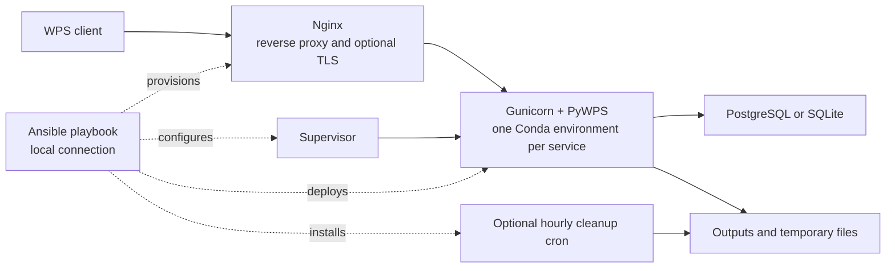

# PyWPS / ROOK Ansible Playbook

An Ansible playbook for deploying and maintaining a production [PyWPS](https://github.com/geopython/pywps) service, in particular [ROOK](https://github.com/roocs/rook).

The playbook installs and configures the complete service stack on a single host.


```mermaid
flowchart LR
    Client["WPS client"] --> Nginx["Nginx<br/>reverse proxy and optional TLS"]
    Nginx --> WPS["Gunicorn + PyWPS<br/>one Conda environment per service"]
    Supervisor["Supervisor"] --> WPS
    WPS --> Database["PostgreSQL or SQLite"]
    WPS --> Files["Outputs and temporary files"]
    Cron["Optional hourly cleanup cron"] --> Files
    Ansible["Ansible playbook<br/>local connection"] -. provisions .-> Nginx
    Ansible -. configures .-> Supervisor
    Ansible -. deploys .-> WPS
    Ansible -. installs .-> Cron
```

## What gets installed?

A typical ROOK deployment includes:

* **Nginx** as the public web server
* **PyWPS / ROOK** in a dedicated Conda environment
* **Supervisor** for the PyWPS service
* **PostgreSQL** for the PyWPS database
* **Slurm** for asynchronous WPS jobs
* monitoring, statistics and maintenance tools
* automatic cleanup of temporary files and WPS outputs

The playbook also manages the service account, directories, configuration files and permissions required by the installation.

## Quick start

Clone the repository:

```bash
git clone https://github.com/bird-house/ansible-wps-playbook.git
cd ansible-wps-playbook
```

Have a look at the example configurations in [`etc/`](https://github.com/bird-house/ansible-wps-playbook/tree/master/etc). They provide ready-to-use starting points for different PyWPS deployments.

For a minimal PyWPS installation, start with the Emu example:

```bash
cp etc/sample-emu.yml custom.yml
```

For a ROOK installation with Slurm, use the ROOK example instead:

```bash
cp etc/sample-rook.yml custom.yml
```

Edit `custom.yml` and replace the site-specific values shown in the sample.

Then deploy:

```bash
make play
```

That's it.

`make play` installs the required Ansible dependencies and runs the complete installation. The playbook is idempotent, so the same command can be used later to apply configuration changes or update an existing installation.

## Updating an installation

For normal maintenance, the Makefile provides two faster update paths.

Update PyWPS sources, configuration and cron jobs without updating the Conda environment:

```bash
make quick
```

Safely update WPS tools, cron jobs and runtime configuration without restarting services or changing Slurm:

```bash
make live
```

Use the full playbook whenever you want to apply the complete configuration:

```bash
make play
```

## Configuration

`custom.yml` should normally contain only the settings that differ for a particular deployment.

The example configurations in [`etc/`](https://github.com/bird-house/ansible-wps-playbook/tree/master/etc) are the best place to start.

The complete set of supported variables, defaults and explanatory comments is maintained in:

```text
group_vars/all.yml
```

Use this file as the configuration reference rather than copying all available settings into `custom.yml`.

### Temporary Gunicorn worker recycling

Gunicorn workers recycle after `gunicorn_max_requests` plus a random number
from zero through `gunicorn_max_requests_jitter` **HTTP requests per worker**.
Jitter staggers worker replacements. The initial mitigation defaults are
100 and 20; tune them under production traffic. These counts are not WPS job
counts, and requests served from nginx's cache do not reach Gunicorn.

Override the shared defaults in `custom.yml` (or the site's configuration):

```yaml
gunicorn_max_requests: 100
gunicorn_max_requests_jitter: 20
```

Both values must be non-negative integers. Set `gunicorn_max_requests: 0` to
disable recycling, even with nonzero jitter. Set jitter to zero for a fixed
request threshold. The settings apply to each configured WPS service.

This is a temporary mitigation for PyWPS database connection accumulation,
not a fix for the session leak in `dblog.pop_first_stored()`. Production saw
43–50 connections idle in transaction with PostgreSQL `max_connections=100`;
SQLAlchemy NullPool does not close sessions that PyWPS leaves open. An upstream
PyWPS fix is still required. Monitor total PostgreSQL connections, PyWPS
connections (especially idle in transaction), connection-slot errors, HTTP
request failures, and worker replacement frequency while tuning these values.
Request-based recycling does not bound connections opened by background work
or guarantee that PostgreSQL stays below its connection limit.

Use the normal `make quick` or `make play` workflow to apply overrides. Both
validate the values before rendering `/etc/gunicorn/<service>.py`; the existing
end-of-play handlers restart Supervisor and nginx. Gunicorn reads the new
configuration on startup. `make live` does not update or activate Gunicorn
settings. Keep `wps_tools_restart_enabled: false`: the daily service restart
cron remains disabled. No separate rollout or restart automation is needed.

The existing `worker_class = 'gevent'`, `timeout = 30`, and default
`graceful_timeout = 30` are unchanged. Gevent workers draining during recycling
can terminate HTTP requests still running after the graceful timeout; check
long-running synchronous requests in staging. See the
[Gunicorn gevent worker implementation](https://github.com/benoitc/gunicorn/blob/master/gunicorn/workers/ggevent.py).
Supervisor still sends TERM, waits `graceful_timeout + 10` seconds (40 by
default), and uses `killasgroup=true`, `stopasgroup=false`. A deployment restart
is broader than a single worker recycling. An asynchronous PyWPS job can
outlive its submitting HTTP request, but scheduler submission, status updates,
and result accessibility must be checked across worker exit. Do not infer job
survival from a successful submission response alone.

#### Staging acceptance check

Run this manually against a staging ROOK deployment with representative data
and the same PyWPS/Gunicorn versions and scheduler mode as production:

1. Temporarily set `gunicorn_workers: 1`, `gunicorn_max_requests: 5`, and
   `gunicorn_max_requests_jitter: 0` in the staging configuration and apply
   through the normal deployment workflow. Record the Gunicorn master and
   worker PIDs from `/var/log/supervisor/rook.log` and the process list.
2. Submit a real asynchronous Rook Execute request (`storeExecuteResponse=true`,
   `status=true`) whose job runs long enough to span recycling. Save the request
   UUID, returned `statusLocation`, and Slurm job ID. With one worker, the
   submitting worker is unambiguous. Confirm the job is accepted/running using
   `ptop rook` and `qtop`.
3. While that job runs, send enough harmless WPS requests to exceed the worker
   threshold. Bypass nginx caching (for example, query the Gunicorn Unix socket
   locally with `curl --unix-socket /run/pywps/rook.sock` and a GetCapabilities
   URL). Confirm the submitting worker PID exits and a replacement starts while
   the master PID stays the same. Do not simulate this by restarting Supervisor.
4. Poll the original `statusLocation` through the normal public URL across the
   recycling event. Verify the same job continues, reaches `ProcessSucceeded`,
   and its output URLs remain accessible and return the expected data. Check
   `ptop rook`, `qtop`, logs, and PostgreSQL connection counts for failures or
   stranded jobs. A missing status document or failed output is a failed check.
5. Also exercise a long-running synchronous HTTP request during recycling and
   look for disconnects, gateway errors, and graceful-timeout messages. Restore
   the normal staging worker count and intended 100/20 settings, then repeat
   representative traffic to assess jitter and connection accumulation.

Local configuration tests cannot establish asynchronous job survival; this
staging check is required before production adoption of the new thresholds.

### Advanced configuration

More advanced deployments can configure, among other things:

* Slurm resources, partitions and job limits
* Conda environments and explicit specification files
* Gunicorn capacity and worker settings
* PostgreSQL
* Nginx and TLS
* PyWPS output and temporary-file retention
* monitoring and statistics
* stalled-job detection and recovery
* scheduled maintenance and cleanup
* filesystem paths and permissions
* ROOK and PyWPS runtime settings

See `group_vars/all.yml` for the complete configuration reference.

On AlmaLinux and other Red Hat hosts using systemd, the local Slurm role installs
`10-state-directory.conf` in the controller service's override directory. Before
each controller start it creates the state directory if missing, restores its
owner and group, and sets mode `0700`. This protects against RPM updates resetting
the directory to `root:root`. It uses `slurm_config.StateSaveLocation` and
`slurm_config.SlurmUser`, falling back to `/var/spool/slurm/ctld` and
`slurm_user.name` (or `slurm`). The group comes from `slurm_user.group`, or the
controller user's primary group. State files and worker spool directories are
not changed recursively.

Deploy this protection with the normal full playbook run (`make play`); the quick
and live update paths do not install it. Installing the override reloads systemd
without restarting the controller. The repair runs on its next start. Hosts with
`slurm_create_dirs: false` retain responsibility for their own state directories.

## Development and testing

The Makefile is also the entry point for development and validation:

```bash
make help          # show all available targets
make test          # run all local checks
make lint          # lint YAML, Ansible and shell scripts
make check         # run the Ansible syntax check
```

Run:

```bash
make help
```

for the current list of available commands.
